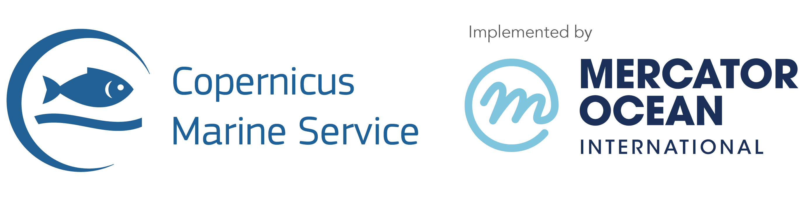

# Copernicus Marine Service toolbox (CLI & Python)



This docker image contains the [copernicusmarine client](https://pypi.org/project/copernicusmarine/) based on the alpine base image.

## Features
The copernicusmarine offers capabilities through both Command Line Interface (CLI) and Python API:

* Metadata Information: List and retrieve metadata information on all variables, datasets, products, and their associated documentation.
* Subset Datasets: Subset datasets to extract only the parts of interest, in preferred format, such as Analysis-Ready Cloud-Optimized (ARCO) Zarr or NetCDF file format.
* Advanced Filters: Apply simple or advanced filters to get multiple files, in original formats like NetCDF/GeoTIFF, via direct Marine Data Store connections.
* No Quotas: Enjoy no quotas, neither on volume size nor bandwidth.

## Usage
The usage of the tool is described in the pypi repo. You will just need to pay attention as this is a docker running version, so bind mounts must be used to transfer content from/to the container filesystem.

General command is:
```bash
docker run -it copernicusmarine -h
```
